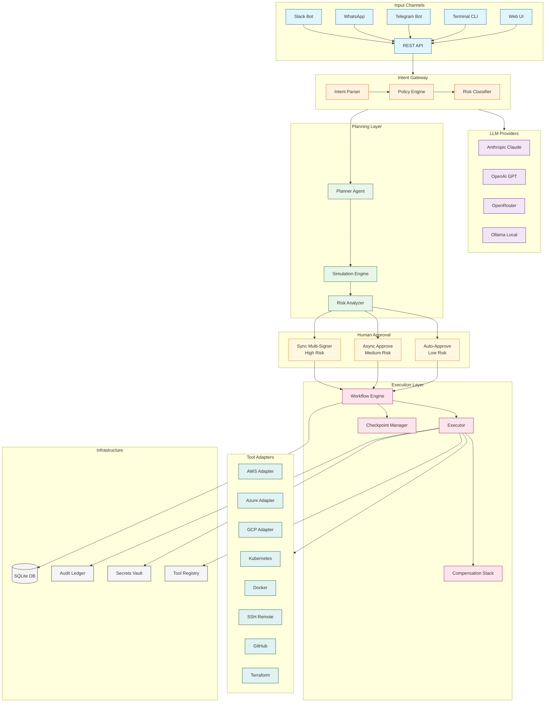
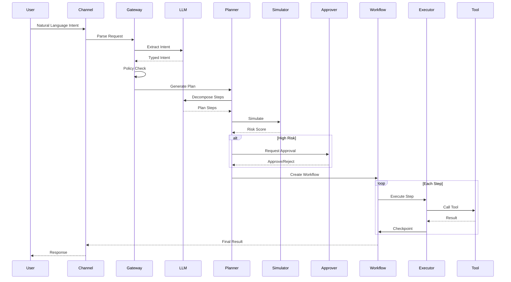
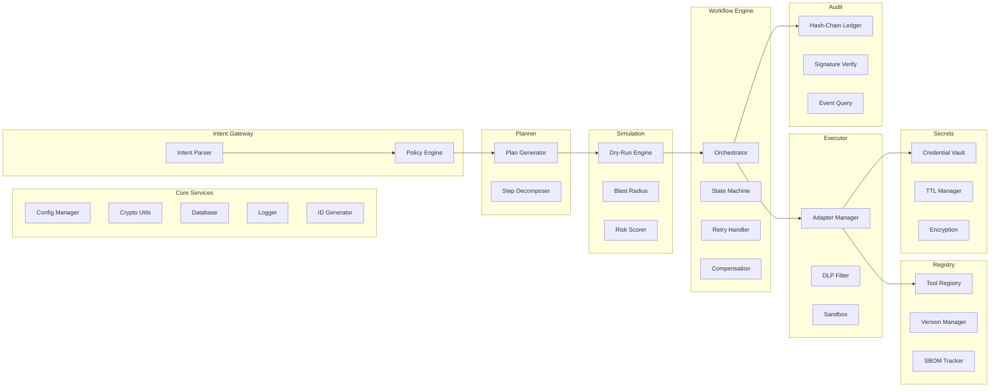

# AEGIS-T2A

**Text-to-Action Anywhere Platform** - A governed multi-agent system for safe, auditable automation.

AEGIS-T2A converts natural language intents into executable, traceable actions across cloud, SaaS, CI/CD, edge, and local systems with enterprise-grade safety controls.

## Features

- **Intent Parsing**: Natural language to typed intent conversion using LLM
- **Multi-LLM Support**: Anthropic Claude, OpenAI, OpenRouter, or local Ollama
- **Policy Engine**: Policy-as-code enforcement with risk classification
- **Plan Generation**: Automatic decomposition into idempotent, compensatable steps
- **Simulation**: Dry-run execution with risk scoring and blast radius analysis
- **Durable Workflow Engine**: Checkpointed execution with retry and compensation
- **Human-in-the-Loop**: Hybrid approval model (auto/async/multi-signer)
- **Audit Ledger**: Immutable, hash-chained event logging
- **Ephemeral Secrets**: Short-lived credentials with zero-trust enforcement
- **Tool Registry**: Versioned adapters with SBOM and capability enforcement
- **Multi-Channel**: Web, Terminal, Telegram, WhatsApp, Slack, API
- **Cloud Providers**: AWS, Azure, GCP, On-premises (SSH/K8s/Docker)

## Architecture



## System Flow



## Component Architecture



## Quick Start

### Prerequisites

- Node.js 20+
- One of: Anthropic API key, OpenAI API key, OpenRouter API key, or Ollama

### Installation

```bash
# Clone the repository
git clone https://github.com/your-org/aegis-t2a.git
cd aegis-t2a

# Install dependencies
npm install

# Run the setup wizard (interactive)
npm run setup

# Or manually configure
cp .env.example .env
# Edit .env with your settings

# Build the project
npm run build

# Start the server
npm start
```

### Setup Wizard

AEGIS-T2A includes an interactive setup wizard for easy configuration:

**Terminal Setup:**
```bash
npm run setup
```

**Browser Setup:**
```bash
npm start
# Open http://localhost:3000 in your browser
# Follow the guided setup wizard
```

The wizard helps you configure:
1. **LLM Provider** - Choose Anthropic, OpenAI, OpenRouter, or Ollama
2. **Cloud Services** - Connect AWS, Azure, GCP, or on-premises environments
3. **Channels** - Enable Telegram, WhatsApp, Slack integrations
4. **Security** - Set approval thresholds and policies

### Using the CLI

```bash
# Process an intent
npm run cli -- intent "Create a new S3 bucket called my-data-bucket"

# With execution
npm run cli -- intent "List all EC2 instances in us-east-1" --execute

# View audit logs
npm run cli -- audit --limit 10

# View registered adapters
npm run cli -- registry
```

### Using Channels

**Telegram:**
1. Create a bot via @BotFather
2. Set `TELEGRAM_BOT_TOKEN` in .env
3. Start chatting with your bot

**WhatsApp:**
1. Set up WhatsApp Business API
2. Configure `WHATSAPP_PHONE_NUMBER_ID` and `WHATSAPP_ACCESS_TOKEN`
3. Set up webhook endpoint

**Slack:**
1. Create a Slack app at api.slack.com
2. Set `SLACK_BOT_TOKEN` and `SLACK_SIGNING_SECRET`
3. Install app to workspace

### Using the API

```bash
# Create an intent
curl -X POST http://localhost:3000/api/v1/intents \
  -H "Content-Type: application/json" \
  -H "X-User-Id: user-123" \
  -d '{"text": "Deploy the latest version of my-app to staging"}'

# Generate a plan
curl -X POST http://localhost:3000/api/v1/intents/{intentId}/plan

# Simulate the plan
curl -X POST http://localhost:3000/api/v1/plans/{planId}/simulate

# Execute the plan
curl -X POST http://localhost:3000/api/v1/plans/{planId}/execute
```

## Project Structure

```
aegis-t2a/
├── src/
│   ├── core/           # Types, crypto, logging, database
│   ├── gateway/        # Intent parsing and policy engine
│   ├── planner/        # Plan generation
│   ├── simulation/     # Dry-run and risk analysis
│   ├── workflow/       # Durable workflow engine
│   ├── executor/       # Tool adapters and execution
│   ├── registry/       # Agent/adapter registry
│   ├── audit/          # Audit ledger
│   ├── secrets/        # Ephemeral credentials
│   ├── api/            # REST API server
│   ├── cli/            # Command-line interface
│   ├── channels/       # Telegram, WhatsApp, Slack
│   └── providers/      # LLM and cloud providers
├── frontend/
│   ├── index.html      # Web UI entry point
│   ├── css/            # Stylesheets
│   └── js/             # Frontend JavaScript
├── tests/              # Test files
├── docs/
│   └── constraints/    # System constraint documentation
└── config/             # Configuration files
```

## Configuration

### Environment Variables

| Variable | Description | Default |
|----------|-------------|---------|
| `PORT` | Server port | 3000 |
| `NODE_ENV` | Environment | development |
| `DATABASE_PATH` | SQLite database path | ./data/aegis.db |
| `LLM_PROVIDER` | LLM provider (anthropic/openai/openrouter/ollama) | anthropic |
| `ANTHROPIC_API_KEY` | Anthropic API key | - |
| `OPENAI_API_KEY` | OpenAI API key | - |
| `OPENROUTER_API_KEY` | OpenRouter API key | - |
| `OLLAMA_BASE_URL` | Ollama server URL | http://localhost:11434 |
| `TELEGRAM_BOT_TOKEN` | Telegram bot token | - |
| `WHATSAPP_PHONE_NUMBER_ID` | WhatsApp phone number ID | - |
| `WHATSAPP_ACCESS_TOKEN` | WhatsApp access token | - |
| `SLACK_BOT_TOKEN` | Slack bot token | - |
| `AWS_ACCESS_KEY_ID` | AWS access key | - |
| `AWS_SECRET_ACCESS_KEY` | AWS secret key | - |
| `AZURE_TENANT_ID` | Azure tenant ID | - |
| `AZURE_CLIENT_ID` | Azure client ID | - |
| `GCP_PROJECT_ID` | GCP project ID | - |
| `JWT_SECRET` | JWT signing secret | - |
| `SECRETS_ENCRYPTION_KEY` | 32-byte hex encryption key | - |
| `REQUIRE_APPROVAL` | Require human approval | true |
| `APPROVAL_THRESHOLD` | Min risk for approval | medium |

## Constraint Documentation

See [`docs/constraints/`](./docs/constraints/) for detailed constraint documentation:

- [Failure Modes](./docs/constraints/FAILURE_MODES.md) - System fault tolerance requirements
- [Human Override](./docs/constraints/HUMAN_OVERRIDE.md) - Approval workflow semantics
- [Observability](./docs/constraints/OBSERVABILITY.md) - Audit and tracing requirements
- [Rollback](./docs/constraints/ROLLBACK.md) - Compensation and recovery strategies

## Development

```bash
# Run in development mode
npm run dev

# Run tests
npm test

# Run tests with coverage
npm run test:coverage

# Type check
npm run typecheck

# Lint
npm run lint
```

## API Reference

### Endpoints

| Method | Path | Description |
|--------|------|-------------|
| GET | `/api/v1/health` | Health check |
| POST | `/api/v1/intents` | Create intent from natural language |
| GET | `/api/v1/intents/:id` | Get intent by ID |
| POST | `/api/v1/intents/:id/plan` | Generate plan for intent |
| GET | `/api/v1/plans/:id` | Get plan by ID |
| POST | `/api/v1/plans/:id/simulate` | Simulate plan execution |
| POST | `/api/v1/plans/:id/execute` | Create and start workflow |
| GET | `/api/v1/workflows/:id` | Get workflow status |
| POST | `/api/v1/workflows/:id/approve` | Approve/reject workflow |
| POST | `/api/v1/workflows/:id/cancel` | Cancel workflow |
| GET | `/api/v1/audit/events` | Query audit events |
| GET | `/api/v1/audit/verify` | Verify audit chain |
| GET | `/api/v1/registry/adapters` | List tool adapters |
| GET | `/api/v1/policy/rules` | List policy rules |
| POST | `/api/v1/test/llm` | Test LLM connection |
| POST | `/api/v1/test/cloud` | Test cloud provider connection |
| POST | `/api/v1/test/channel` | Test channel connection |

### Webhook Endpoints

| Method | Path | Description |
|--------|------|-------------|
| POST | `/webhooks/telegram` | Telegram bot webhook |
| GET/POST | `/webhooks/whatsapp` | WhatsApp webhook |
| POST | `/webhooks/slack/events` | Slack events webhook |
| POST | `/webhooks/slack/interactions` | Slack interactions webhook |

## Security

- **Authentication**: JWT-based with OIDC support
- **Authorization**: Role-based access control (RBAC)
- **Secrets**: Ephemeral credentials with short TTL, HSM/KMS integration
- **Audit**: Immutable, hash-chained event log with signatures
- **Isolation**: Sandboxed executor with DLP filtering
- **Policy**: Deny-by-default with explicit allowlists
- **Approval**: Risk-based human-in-the-loop enforcement

## Supported Integrations

### Cloud Providers
- **AWS**: EC2, S3, Lambda, and more
- **Azure**: VMs, Storage, Functions
- **GCP**: Compute Engine, Cloud Storage, Cloud Functions
- **On-Premises**: SSH, Kubernetes, Docker

### LLM Providers
- **Anthropic**: Claude 3.5 Sonnet, Opus, Haiku
- **OpenAI**: GPT-4, GPT-4 Turbo, GPT-3.5
- **OpenRouter**: Access to multiple providers
- **Ollama**: Local open-source models (Llama, Mistral, etc.)

### Communication Channels
- **Web UI**: Browser-based dashboard
- **Terminal**: Interactive CLI with setup wizard
- **Telegram**: Bot integration
- **WhatsApp**: Business API integration
- **Slack**: Workspace bot
- **REST API**: Programmatic access

## License

MIT
