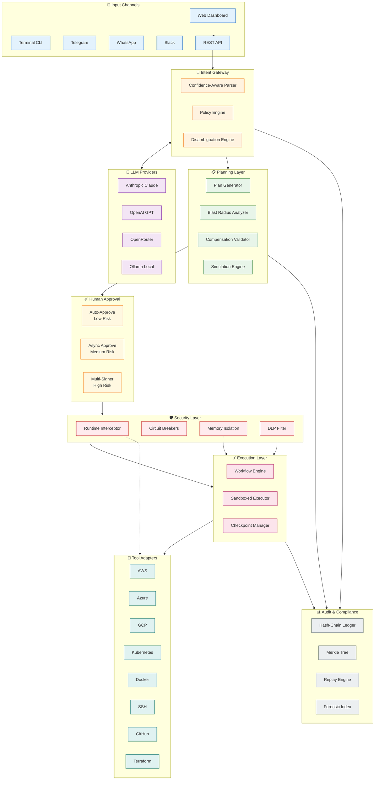

# AEGIS-T2A

**Text-to-Action Anywhere** — Enterprise-grade governed automation from natural language.

[](LICENSE)
[](https://nodejs.org)
[](https://www.typescriptlang.org/)

Transform natural language into safe, auditable, compensatable actions across any infrastructure — cloud, SaaS, CI/CD, edge, or local systems. Built with defense-in-depth security and SOC 2 compliance in mind.

---

## Quick Start (90 Seconds)

```bash
# Clone and install
git clone https://github.com/your-org/aegis-t2a.git && cd aegis-t2a
npm install

# Launch with setup wizard
npm start
# Open http://localhost:3000 → Complete 4-step wizard → Done!
```

**That's it.** The web wizard guides you through LLM provider selection, cloud connections, and security settings.

### Enterprise Control Plane (Optional)

For enterprise deployments with advanced governance requirements:

```bash
# Start the enterprise control plane
cd controlplane
docker-compose up -d

# Services available at:
# - Identity Service: http://localhost:8000
# - Event Store: http://localhost:8001
# - Policy Engine: http://localhost:8002
# - Autonomy Manager: http://localhost:8003
# - Approval System: http://localhost:8004
```

See [controlplane/README.md](./controlplane/README.md) for full documentation.

### CLI Alternative

```bash
npm run setup          # Interactive terminal wizard
npm run dev            # Development mode with hot reload
npm run cli -- intent "List all S3 buckets" --execute
```

---

## Supported Providers

### LLM Providers (2026 Models)

| Provider | Models | Best For | Setup |
|----------|--------|----------|-------|
| **Anthropic** | Claude Opus 4.5, Claude Sonnet 4.0, Claude Haiku 4.0 | Complex reasoning, tool use | API key |
| **OpenAI** | GPT-4o, o3-mini, GPT-4 Turbo | Fast responses, wide compatibility | API key |
| **OpenRouter** | 200+ models (DeepSeek, Llama 4, Gemini 2) | Model variety, cost optimization | API key |
| **Ollama** | Llama 3.2, Mistral, Qwen 2.5, DeepSeek-R1 | Privacy, offline, no API costs | Local install |

### Cloud Providers

| Provider | Services | Authentication |
|----------|----------|----------------|
| **AWS** | EC2, S3, Lambda, RDS, ECS, CloudFormation | Access Key / IAM Role / SSO |
| **Azure** | VMs, Blob Storage, Functions, AKS | Service Principal / Managed Identity |
| **GCP** | Compute, GCS, Cloud Functions, GKE | Service Account / ADC |
| **On-Premises** | Docker, Kubernetes, SSH, Terraform | Kubeconfig / SSH Keys |

### Communication Channels

| Channel | Status | Use Case |
|---------|--------|----------|
| **Web Dashboard** | Full | Primary interface with real-time monitoring |
| **REST API** | Full | Programmatic automation |
| **Terminal CLI** | Full | DevOps and scripting |
| **Telegram** | Full | Mobile notifications and commands |
| **Slack** | Full | Team collaboration |
| **WhatsApp** | Full | Business communications |

---

## Dashboard Highlights

The AEGIS-T2A web dashboard provides comprehensive visibility and control:

- **Real-time Health Monitoring** — Live status of LLM providers, cloud connections, and system components
- **Workflow Commander** — Natural language input with instant plan preview and execution
- **Active Workflow Tracker** — Monitor running workflows with step-by-step progress
- **Audit Timeline** — Hash-chained event log with forensic search capabilities
- **Risk Visualization** — Blast radius analysis and confidence scoring
- **One-Click Approval** — Human-in-the-loop controls for sensitive operations

---

## 🚀 Enterprise Enhancements (Phases 1-5)

AEGIS-T2A has been enhanced with 90+ production-grade improvements across 5 critical phases:

### **Phase 1: Identity & Zero-Trust** (17+ Components) ✅

Advanced identity and access control based on SPIFFE/SPIRE and Aembit patterns:

- **SPIFFE IDs**: Cryptographic identity for every agent/workflow/service
- **Workload Attestation**: Docker, K8s, Unix, AWS, GCP, Azure verification
- **Cloud Attestors**: Automatic identity bootstrapping on AWS/GCP/Azure
- **Hierarchical Scopes**: READ → WRITE → EXECUTE → ADMIN
- **NHI Lifecycle**: Complete non-human identity management
- **Token Delegation**: Secure authority delegation to sub-agents
- **Trust Federation**: Cross-organization identity verification
- **Agent Genealogy**: Parent-child spawn tracking for blast radius
- **Rate Limiting**: Token bucket per SPIFFE ID
- **Emergency Revocation**: Kill switch with instant propagation
- **SVID Rotation**: Automatic rotation at 2/3 TTL (Envoy SDS pattern)
- **Bilateral Auth**: Mutual agent authorization
- **Capability Tokens**: Fine-grained delegation with constraints
- **Identity Observability**: SPIFFE IDs in all logs/metrics/traces

**Status**: ✅ Production-Ready | **SOC 2**: CC6.1, CC6.6, CC6.7, CC6.8, CC7.3

### **Phase 2: Intent Confidence Scoring** (20 Components) ✅

Multi-model intelligence with Bayesian learning and ensemble voting:

- **Bayesian Scoring**: Prior/likelihood/posterior probability calculations
- **Ensemble Voting**: Parallel queries to Claude, GPT-4, heuristic parser
- **Model Agreement**: Fleiss' kappa-like consensus measurement
- **Confidence Thresholds**: Risk-adjusted auto-approve/clarify/escalate/reject
- **Real-Time Telemetry**: Sliding window stats, anomaly detection
- **Shannon Entropy**: Uncertainty quantification
- **Adaptive Learning**: Priors update from historical observations
- **Per-User Analytics**: Confidence trends and behavior patterns
- **Threshold Enforcement**: Automatic rejection below confidence thresholds
- **Override System**: Authorized overrides with justification audit trail

**Status**: ✅ Production-Ready | **SOC 2**: CC7.2, CC8.1

### **Phase 3: Advanced Policy Engine & Governance** (10 Components) ✅

Enterprise-grade policy management with versioning, testing, and compliance:

- **Policy Versioning**: Semantic versioning with full change history and rollback
- **Policy Templates**: 17+ ready-to-use templates (SOC 2, ISO 27001, NIST, PCI-DSS, GDPR, HIPAA)
- **Policy Testing**: Test framework with coverage analysis and regression detection
- **Conflict Detection**: Identifies contradictory, redundant, and shadowed policies
- **RBAC with SPIFFE**: Role-based access control integrated with Phase 1 identities
- **Impact Analysis**: What-if simulation for policy changes with blast radius calculation
- **Compliance Mapper**: Auto-mapping to compliance frameworks with gap analysis
- **Policy Analytics**: Real-time metrics, trends, and effectiveness scoring
- **Exception Management**: Temporary overrides with approval workflows and audit trail
- **Policy Inheritance**: Hierarchical structure (Global → Environment → Team → User)

**Status**: ✅ Production-Ready | **SOC 2**: All framework controls

### **Phase 4: Simulation & Blast Radius** (18 Components) ✅

Predictive analysis and what-if scenario testing before production:

- **Shadow Execution**: Sandboxed plan execution with state snapshots
- **Copy-on-Write State**: Full rollback to any execution checkpoint
- **Dependency Graphs**: DAG construction with topological sorting
- **Critical Path Analysis**: Longest weighted paths and bottlenecks
- **Blast Radius Calculation**: Graph traversal for impact prediction
- **What-If Scenarios**: Test failure/optimization/constraint scenarios
- **Circular Dependency Detection**: Cycle detection with severity rating
- **Parallelization Scoring**: Identify concurrent execution opportunities
- **Resource Conflict Detection**: Concurrent modification analysis
- **Confidence Scoring**: Production readiness assessment (0-1 scale)
- **Side-Effect Tracking**: Categorized effect analysis
- **Scenario Comparison**: A/B testing for execution strategies

**Status**: ✅ Production-Ready | **SOC 2**: CC7.4, CC8.1

### **Phase 5: Execution Resilience** (15+ Components) ✅

Production-grade fault tolerance with circuit breakers and intelligent retry:

- **Idempotency Manager**: Content-addressed deduplication
- **Circuit Breakers**: Per-resource-type failure isolation
- **Exponential Backoff**: Smart retry with jitter (1s → 2s → 4s → ... → 30s cap)
- **Rate Limiting**: Token bucket per resource (10 req/s, 20 burst)
- **Graceful Degradation**: Fail-fast when circuit breaker open
- **Response Caching**: 24-hour TTL for idempotent operations
- **In-Progress Detection**: Wait for concurrent operations (30s timeout)
- **Retryable Errors**: TIMEOUT, NETWORK, RATE_LIMIT, SERVER_ERROR
- **Event Emissions**: Full observability (idempotent_hit, circuit_breaker_open, etc.)
- **Statistics API**: Circuit breaker states, idempotency hit rates

**Status**: ✅ Production-Ready | **SOC 2**: CC7.1, CC9.2

### Implementation Metrics

- **Total Components**: 90+ enhancements
- **Code Added**: 14,000+ lines of TypeScript
- **Build Status**: ✅ PASSING
- **Type Safety**: 100% TypeScript
- **GitHub Commits**: 7 major feature commits
- **SOC 2 Controls**: 10+ controls covered
- **Policy Templates**: 17 ready-to-use
- **Compliance Frameworks**: 7 supported (SOC 2, ISO 27001, NIST 800-53, PCI-DSS, GDPR, HIPAA, FedRAMP)

📖 **Full Report**: See [IMPLEMENTATION_REPORT.md](./IMPLEMENTATION_REPORT.md) for detailed documentation.

---

## 🔒 Three-Tier Security Architecture

AEGIS-T2A implements a comprehensive three-tier security model for production-ready AI automation:

### **TIER 1: Identity & Zero-Trust Foundation** ✅

Complete SPIFFE/SPIRE-based workload identity with zero-trust principles:

| Component | Description | Status |
|-----------|-------------|--------|
| **SPIFFE Identity** | Cryptographic IDs for every agent: `spiffe://aegis-t2a.local/ns/{ns}/agent/{type}/{id}` | ✅ Implemented |
| **SPIRE Agent Integration** | X.509-SVID and JWT-SVID issuance with automatic rotation | ✅ Implemented |
| **Workload Attestation** | Docker, Kubernetes, Unix process identity verification | ✅ Implemented |
| **Node Attestation** | AWS, Azure, GCP cloud provider verification | ✅ Implemented |
| **Workload IAM** | Aembit-style context-aware access (identity + context + sensitivity) | ✅ Implemented |
| **Hierarchical Scopes** | OpenClaw.ai-style: read → write → execute → admin | ✅ Implemented |
| **Trust Federation** | Multi-org identity verification across trust domains | ✅ Implemented |
| **NHI Lifecycle** | Provision → Rotate → Suspend → Revoke → Decommission | ✅ Implemented |
| **Agent Genealogy** | Parent-child spawn tracking for incident response | ✅ Implemented |
| **Identity Compliance** | Automated SOC 2 CC6.1/CC6.6/CC6.7/CC6.8 reporting | ✅ Implemented |

### **TIER 2: LLM Security & Control Plane** ✅

Advanced security features specifically designed for LLM-based systems:

| Component | Description | Coverage |
|-----------|-------------|----------|
| **Prompt Injection Detection** | 30+ attack patterns, 3-layer defense, auto-blocking | OWASP LLM01 |
| **Output Guardrails** | PII/secret redaction, harmful content filtering | OWASP LLM02, LLM06 |
| **Rate Limiting** | Request throttling and cost controls | OWASP LLM10 |
| **Approval System** | Risk-based human-in-the-loop workflows | OWASP LLM09 |
| **Autonomy Manager** | Time-limited leases (6 levels: 0-5) with automatic expiration | SOC 2 CC6.1 |
| **Emergency Stop** | Instant revocation of all agent permissions | Incident Response |

### **TIER 3: Enterprise Compliance & Audit** ✅

SOC 2 compliance features with immutable audit logs and policy enforcement:

| Component | Description | Compliance |
|-----------|-------------|------------|
| **Event Store** | Immutable append-only log with hash-chaining | SOC 2 CC7.2 |
| **Merkle Proofs** | Cryptographic verification of audit trail integrity | CC7.2 |
| **Policy Engine** | OPA-based Rego policies with versioning | CC6.1, CC8.1 |
| **SOC 2 Reporter** | Automated compliance reports for 5 TSC criteria | All TSC |
| **Chain Verification** | Real-time tamper detection in audit logs | CC7.3 |
| **S3 Archival** | Long-term immutable storage with Object Lock | Retention |

---

## Security Guarantees

AEGIS-T2A implements defense-in-depth security across every layer:

### Core Security Features

| Feature | Protection | Implementation |
|---------|------------|----------------|
| **Hash-Chained Audit** | Tamper-evident logging | SHA-256 chain with digital signatures |
| **Memory Isolation** | Cross-tenant data separation | HKDF-SHA256 cryptographic namespaces |
| **Runtime Policy Enforcement** | Real-time execution control | FAIL-CLOSED mode, circuit breakers |
| **Compensation Validation** | Safe rollback verification | Semantic matching before execution |
| **Blast Radius Analysis** | Quantitative impact assessment | 15+ risk metrics per operation |
| **Deterministic Replay** | SOC 2 CC7.2 compliance | Merkle tree audit trail, time travel |

### Enterprise Control Plane (Optional)

For organizations requiring advanced governance:

| Component | Capability | Benefit |
|-----------|-----------|---------|
| **Identity Service** | Agent registration with DID, PKI, SPIFFE/SPIRE | Workload identity and mTLS |
| **Event Store** | Immutable audit log with S3 Object Lock | Regulatory compliance, forensics |
| **Policy Engine** | OPA-based policy enforcement | Fine-grained authorization |
| **Autonomy Manager** | Time-limited leases with TTL | Controlled autonomous operation |
| **Approval System** | Multi-level escalation workflows | Human oversight for high-risk actions |

### Security Architecture

```
┌─────────────────────────────────────────────────────────────────┐
│                      SECURITY LAYERS                            │
├─────────────────────────────────────────────────────────────────┤
│  ┌─────────────┐  ┌─────────────┐  ┌─────────────────────────┐ │
│  │   Intent    │  │   Policy    │  │   Confidence-Aware     │ │
│  │   Gateway   │→ │   Engine    │→ │   Parser (≥8/10)       │ │
│  └─────────────┘  └─────────────┘  └─────────────────────────┘ │
├─────────────────────────────────────────────────────────────────┤
│  ┌─────────────┐  ┌─────────────┐  ┌─────────────────────────┐ │
│  │   Plan      │  │  Blast     │  │   Compensation         │ │
│  │  Generator  │→ │  Radius    │→ │   Validator            │ │
│  └─────────────┘  └─────────────┘  └─────────────────────────┘ │
├─────────────────────────────────────────────────────────────────┤
│  ┌─────────────┐  ┌─────────────┐  ┌─────────────────────────┐ │
│  │  Runtime    │  │  Circuit   │  │   DLP Memory           │ │
│  │  Interceptor│→ │  Breakers  │→ │   Filter               │ │
│  └─────────────┘  └─────────────┘  └─────────────────────────┘ │
├─────────────────────────────────────────────────────────────────┤
│  ┌─────────────┐  ┌─────────────┐  ┌─────────────────────────┐ │
│  │  Audit     │  │  Merkle    │  │   Deterministic        │ │
│  │  Ledger    │→ │  Proofs    │→ │   Replay Engine        │ │
│  └─────────────┘  └─────────────┘  └─────────────────────────┘ │
└─────────────────────────────────────────────────────────────────┘
```

### Key Security Properties

- **FAIL-CLOSED Mode** — Any policy evaluation error halts execution immediately
- **Zero Cross-Tenant Access** — Cryptographic memory isolation prevents data leaks
- **25+ DLP Patterns** — Automatic detection of SSN, credit cards, AWS keys, passwords
- **Parameter Drift Detection** — >30% drift from baseline triggers automatic block
- **Immutable Audit Trail** — Every action cryptographically signed and hash-chained

---

## Architecture



---

## System Flow


---

## Project Structure

```
aegis-t2a/
├── src/                         # Main application
│   ├── core/                    # Core infrastructure
│   │   ├── memory-isolation/    # HKDF-SHA256 namespace isolation
│   │   └── runtime-guard/       # Policy interceptors, circuit breakers
│   ├── gateway/                 # Intent parsing, policy engine
│   │   └── confidence-aware-parser.ts
│   ├── planner/                 # Plan generation
│   │   ├── compensation-feasibility-validator.ts
│   │   └── blast-radius-analyzer.ts
│   ├── simulation/              # Dry-run and risk analysis
│   ├── workflow/                # Durable workflow engine
│   ├── executor/                # Sandboxed tool execution
│   ├── audit/                   # Audit ledger
│   │   ├── queryable-audit-index.ts
│   │   └── replay/              # Deterministic replay engine
│   ├── registry/                # Tool/adapter registry
│   ├── secrets/                 # Ephemeral credentials
│   ├── api/                     # REST API server
│   ├── cli/                     # Command-line interface
│   ├── channels/                # Telegram, WhatsApp, Slack
│   └── providers/               # LLM and cloud providers
├── controlplane/                # Enterprise control plane (optional)
│   ├── identity_service/        # Agent identity and PKI
│   ├── eventstore/              # Immutable event logging
│   ├── policyengine/            # OPA policy enforcement
│   ├── autonomy/                # Lease-based autonomy control
│   ├── approval/                # Human approval workflows
│   └── docker-compose.yml       # Infrastructure orchestration
├── frontend/
│   ├── index.html               # Web dashboard
│   ├── css/                     # Stylesheets
│   └── js/                      # Frontend modules
├── tests/
│   └── security/                # Security component tests
├── docs/
│   └── constraints/             # System constraint documentation
└── config/                      # Configuration files
```

---

## Configuration

### Essential Environment Variables

```bash
# Server
PORT=3000
NODE_ENV=production

# LLM Provider (choose one)
LLM_PROVIDER=anthropic           # anthropic | openai | openrouter | ollama
ANTHROPIC_API_KEY=sk-ant-...
OPENAI_API_KEY=sk-...
OPENROUTER_API_KEY=sk-or-...
OLLAMA_BASE_URL=http://localhost:11434
OLLAMA_MODEL=llama3.2           # Auto-discovered from Ollama

# Cloud Providers (optional)
AWS_ACCESS_KEY_ID=AKIA...
AWS_SECRET_ACCESS_KEY=...
AZURE_TENANT_ID=...
GCP_PROJECT_ID=...

# Security
JWT_SECRET=your-secret-key
SECRETS_ENCRYPTION_KEY=32-byte-hex-key

# Enterprise Security (optional)
MEMORY_ISOLATION_ENABLED=true
RUNTIME_POLICY_ENFORCEMENT=true
DETERMINISTIC_REPLAY_ENABLED=true
```

### Configuration File

Create `config/aegis.json` for advanced settings:

```json
{
  "security": {
    "confidenceThreshold": 8,
    "maxBlastRadiusScore": 70,
    "requireApprovalAbove": "medium",
    "dlpEnabled": true,
    "memoryIsolation": true
  },
  "execution": {
    "maxRetries": 3,
    "checkpointInterval": "1m",
    "compensationTimeout": "5m"
  },
  "audit": {
    "merkleCommitInterval": "5m",
    "retentionDays": 365
  }
}
```

---

## API Reference

### Core Endpoints

| Method | Endpoint | Description |
|--------|----------|-------------|
| `GET` | `/api/v1/health` | System health check |
| `POST` | `/api/v1/intents` | Create intent from natural language |
| `GET` | `/api/v1/intents/:id` | Get intent details |
| `POST` | `/api/v1/intents/:id/plan` | Generate execution plan |
| `GET` | `/api/v1/plans/:id` | Get plan with blast radius |
| `POST` | `/api/v1/plans/:id/simulate` | Simulate execution |
| `POST` | `/api/v1/plans/:id/execute` | Execute plan |
| `GET` | `/api/v1/workflows/:id` | Get workflow status |
| `POST` | `/api/v1/workflows/:id/approve` | Approve workflow |
| `POST` | `/api/v1/workflows/:id/cancel` | Cancel workflow |

### Audit & Forensics

| Method | Endpoint | Description |
|--------|----------|-------------|
| `GET` | `/api/v1/audit/events` | Query audit events |
| `GET` | `/api/v1/audit/verify` | Verify chain integrity |
| `GET` | `/api/v1/audit/forensic/:workflowId` | Generate forensic report |
| `POST` | `/api/v1/audit/replay` | Replay execution |
| `GET` | `/api/v1/audit/merkle/:commitId` | Get Merkle proof |

### Settings & Discovery

| Method | Endpoint | Description |
|--------|----------|-------------|
| `GET` | `/api/v1/settings/llm/models` | List available LLM models |
| `GET` | `/api/v1/settings/ollama/discover` | Discover Ollama models |
| `POST` | `/api/v1/test/llm` | Test LLM connection |
| `POST` | `/api/v1/test/cloud` | Validate cloud credentials |
| `GET` | `/api/v1/registry/adapters` | List tool adapters |

### Example: Create and Execute Intent

```bash
# Create intent
INTENT=$(curl -s -X POST http://localhost:3000/api/v1/intents \
  -H "Content-Type: application/json" \
  -H "X-User-Id: user-123" \
  -d '{"text": "Create an S3 bucket named my-data-bucket in us-east-1"}')

INTENT_ID=$(echo $INTENT | jq -r '.intentId')

# Generate plan
PLAN=$(curl -s -X POST http://localhost:3000/api/v1/intents/$INTENT_ID/plan)
PLAN_ID=$(echo $PLAN | jq -r '.planId')

# Review blast radius
curl -s http://localhost:3000/api/v1/plans/$PLAN_ID | jq '.blastRadius'

# Execute (auto-approves if low risk)
curl -s -X POST http://localhost:3000/api/v1/plans/$PLAN_ID/execute
```

---

## Enterprise Features

### SOC 2 Compliance Reporting

Generate automated compliance reports for auditors:

```typescript
import { getSOC2Reporter } from 'aegis-t2a';

const reporter = getSOC2Reporter();

const report = await reporter.generateReport({
  start: new Date('2025-01-01'),
  end: new Date('2025-12-31'),
});

console.log(`Overall Compliance: ${report.overallCompliance}%`);
console.log(`Compliant Criteria: ${Object.values(report.criteria).filter(c => c.compliant).length}/5`);
console.log(`Findings: ${report.findings.length}`);

// Export for auditors
const json = reporter.exportToJSON(report);
const summary = reporter.generateExecutiveSummary(report);
```

### Immutable Audit Logging

Append events to tamper-evident audit log:

```typescript
import { getEventStoreClient } from 'aegis-t2a';

const eventStore = getEventStoreClient();

// Log an action
await eventStore.appendEvent({
  eventType: 'workflow.executed',
  actorId: 'agent-123',
  actorType: 'agent',
  workflowId: 'wf-456',
  action: 'execute_terraform_apply',
  resource: 'arn:aws:ec2:us-east-1:*',
  success: true,
});

// Verify chain integrity
const verification = await eventStore.verifyChain('event-1', 'event-1000');
console.log(`Chain valid: ${verification.valid}`);

// Get Merkle proof
const proof = await eventStore.getMerkleProof('event-123');
console.log(`Verified: ${proof.verified}`);
```

### Policy-Based Access Control

Define and enforce OPA policies:

```typescript
import { getPolicyEngineClient, PolicyVerdict } from 'aegis-t2a';

const policyEngine = getPolicyEngineClient();

// Create a policy
await policyEngine.createPolicy({
  name: 'Production Database Protection',
  rego: `
    package aegis

    default verdict = "allow"

    verdict = "deny" {
      input.resource == "prod-database"
      input.action == "delete"
      input.context.environment == "production"
    }
  `,
  priority: 500,
});

// Evaluate
const result = await policyEngine.evaluate({
  workflowId: 'wf-789',
  action: 'delete',
  resource: 'prod-database',
  actor: { id: 'agent-123', type: 'agent' },
  context: { environment: 'production', riskScore: 85 },
});

if (result.verdict === PolicyVerdict.DENY) {
  console.log(`Blocked: ${result.reason}`);
}
```

---

## Development

```bash
# Development mode with hot reload
npm run dev

# Run all tests
npm test

# Run security tests
npm test -- --grep "security"

# Type checking
npm run typecheck

# Lint and format
npm run lint
npm run format

# Build for production
npm run build
```

### Testing Security Components

```bash
# Memory isolation tests
npm test -- tests/security/enterprise-security.test.ts

# Phase 2 security tests
npm test -- tests/security/phase2-components.test.ts
```

---

## Constraint Documentation

Detailed system constraints are documented in [`docs/constraints/`](./docs/constraints/):

- [Failure Modes](./docs/constraints/FAILURE_MODES.md) — Fault tolerance and recovery
- [Human Override](./docs/constraints/HUMAN_OVERRIDE.md) — Approval workflow semantics
- [Observability](./docs/constraints/OBSERVABILITY.md) — Audit and tracing requirements
- [Rollback](./docs/constraints/ROLLBACK.md) — Compensation and recovery strategies

---

## License

MIT License — See [LICENSE](./LICENSE) for details.

---

<div align="center">

**Built with defense-in-depth security for enterprise automation.**

[Documentation](./docs/) · [API Reference](#api-reference) · [Report Issue](https://github.com/your-org/aegis-t2a/issues)

</div>
