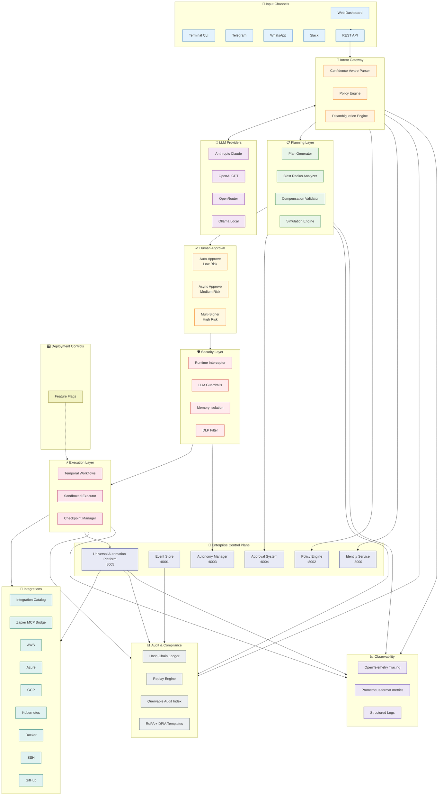
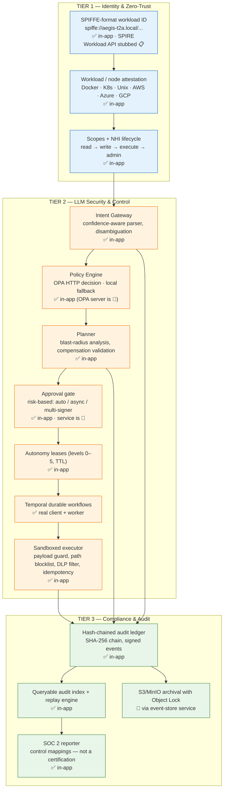
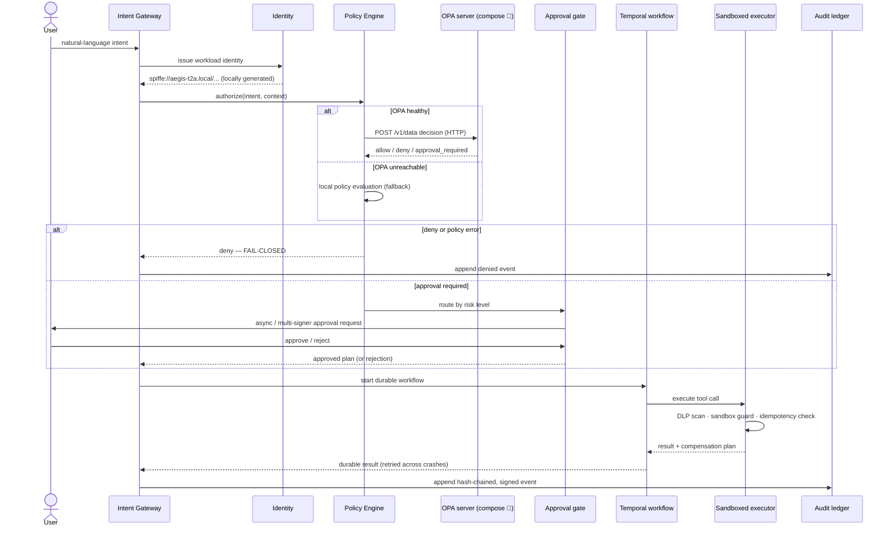
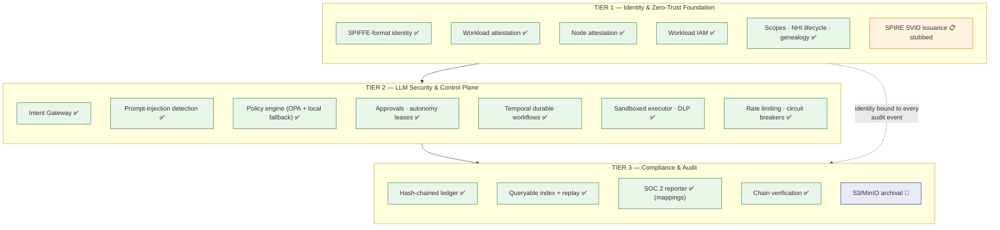
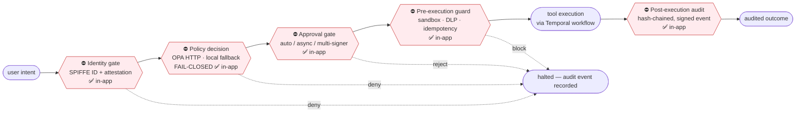
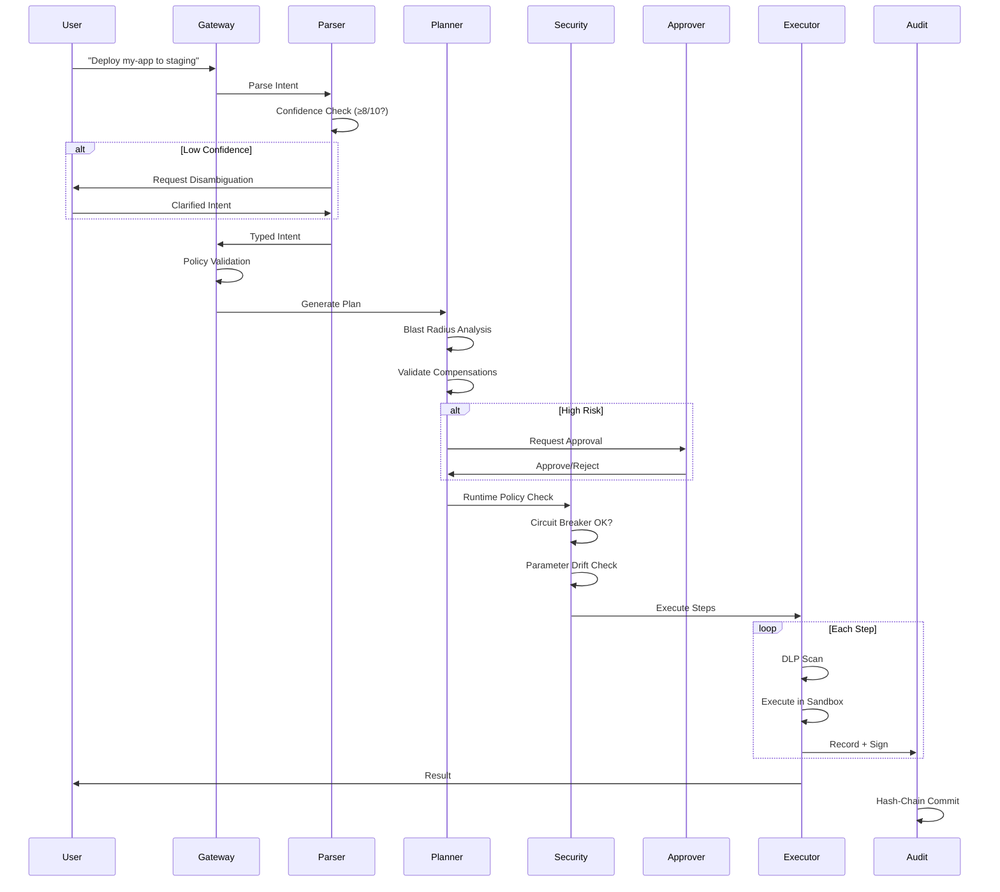

# AEGIS-T2A

**Text-to-Action Anywhere** — Enterprise-grade governed automation from natural language.

[](LICENSE)
[](https://github.com/ekuelkpodar/aegis-t2a/actions/workflows/automation-guards.yml)
[](https://nodejs.org)
[](https://www.typescriptlang.org/)

Transform natural language into safe, auditable, compensatable actions across any infrastructure — cloud, SaaS, CI/CD, edge, or local systems. Built with defense-in-depth security and SOC 2 compliance in mind.

---

## Quick Start (90 Seconds)

```bash
# Clone and install
git clone https://github.com/ekuelkpodar/aegis-t2a.git && cd aegis-t2a
npm install

# Launch with setup wizard
npm start
# Open http://localhost:3000 → Complete 4-step wizard → Done!
```

**That's it.** The web wizard guides you through LLM provider selection, cloud connections, and security settings.

### Enterprise Control Plane (Optional)

For enterprise deployments with advanced governance requirements:

```bash
# Start the enterprise control plane
cd controlplane
docker-compose up -d

# Services available at:
# - Identity Service: http://localhost:8000
# - Event Store: http://localhost:8001
# - Policy Engine: http://localhost:8002
# - Autonomy Manager: http://localhost:8003
# - Approval System: http://localhost:8004
# - Universal Automation Platform: http://localhost:8005
```

See [controlplane/README.md](./controlplane/README.md) for full documentation.

### CLI Alternative

```bash
npm run setup          # Interactive terminal wizard
npm run dev            # Development mode with hot reload
npm run cli -- intent "List all S3 buckets" --execute
```

---

## Supported Providers

### LLM Providers

| Provider | Best For | Setup |
|----------|----------|-------|
| **Anthropic** | Complex reasoning, tool use | API key |
| **OpenAI** | Fast responses, wide compatibility | API key |
| **OpenRouter** | Model variety, cost optimization | API key |
| **Ollama** | Privacy, offline, no API costs | Local install |

### Cloud Providers

| Provider | Services | Authentication |
|----------|----------|----------------|
| **AWS** | EC2, S3, Lambda, RDS, ECS, CloudFormation | Access Key / IAM Role / SSO |
| **Azure** | VMs, Blob Storage, Functions, AKS | Service Principal / Managed Identity |
| **GCP** | Compute, GCS, Cloud Functions, GKE | Service Account / ADC |
| **On-Premises** | Docker, Kubernetes, SSH, Terraform | Kubeconfig / SSH Keys |

### Communication Channels

| Channel | Status | Use Case |
|---------|--------|----------|
| **Web Dashboard** | Full | Primary interface with real-time monitoring |
| **REST API** | Full | Programmatic automation |
| **Terminal CLI** | Full | DevOps and scripting |
| **Telegram** | Full | Mobile notifications and commands |
| **Slack** | Full | Team collaboration |
| **WhatsApp** | Full | Business communications |

---

## Dashboard Highlights

The AEGIS-T2A web dashboard provides comprehensive visibility and control:

- **Real-time Health Monitoring** — Live status of LLM providers, cloud connections, and system components
- **Workflow Commander** — Natural language input with instant plan preview and execution
- **Active Workflow Tracker** — Monitor running workflows with step-by-step progress
- **Audit Timeline** — Hash-chained event log with forensic search capabilities
- **Risk Visualization** — Blast radius analysis and confidence scoring
- **One-Click Approval** — Human-in-the-loop controls for sensitive operations

---

## Current Capabilities

Capabilities are grouped by how they are actually delivered today — **in the app**, **via the optional control-plane stack**, or **specified but not yet wired**. Per-phase completion percentages live in `docs/IMPLEMENTATION_REPORT.md`; this section intentionally does not repeat roadmap items as shipped features.

### ✅ Implemented in the app

- **Temporal Workflows** — Durable orchestration with signals/queries and schedules via a real `@temporalio/*` integration.
- **Hash-chained audit ledger** — Append-only event store with tamper-evident chaining, forensic search, and export.
- **Policy engine with OPA integration** — Evaluates against a configured OPA server (`/v1/data/aegis/authz/decision`) and falls back to a built-in evaluator when OPA is unreachable. Rego bundles ship in `src/governance/policy/opa/` and industry packs in `policies/examples/industry/`; both are evaluated by the real OPA binary in CI.
- **Identity & lifecycle** — SPIFFE-format workload IDs (`spiffe://aegis-t2a.local/...`), attestor modules (Docker, AWS, Azure, GCP), delegation, non-human-identity lifecycle, revocation.
- **Safety** — Pattern-based prompt-injection detection with auto-blocking, PII/secret redaction, LLM output guardrails, intent/plan alignment checks, risk-based human approvals, autonomy leases, emergency stop.
- **Resilience** — Idempotency, per-resource circuit breakers, exponential backoff with jitter, rate limiting.
- **Observability** — OpenTelemetry tracing and a Prometheus-format `/metrics` endpoint.
- **Compliance tooling** — SOC 2 report generator, RoPA records, DPIA templates, and control mappings for SOC 2, ISO 27001, NIST 800-53, PCI-DSS, GDPR, and HIPAA.
- **DevEx** — CLI, web dashboard, evaluation harness, feature flags, model routing, prompt cache, Telegram/Slack/WhatsApp channels.

### 🐳 Available via the optional control-plane stack

`controlplane/docker-compose.yml` stands up the enterprise services as real containers. The main app degrades gracefully when they are absent:

- **OPA** (policy decision point), **PostgreSQL** (control-plane state), **HashiCorp Vault** in dev mode (secrets/PKI), **MinIO** (S3-compatible event-store archival), plus identity, event-store, policy-engine, autonomy-manager, and approval services. A SPIRE server deployment manifest is provided for Kubernetes (`controlplane/spire/`).

### 📋 Specified, not yet wired

Documented in the roadmap but not current capability:

- **Real SPIRE-issued SVIDs** — the app generates SPIFFE-format IDs locally; X.509/JWT-SVID issuance from a live SPIRE server is planned.
- **In-app Vault client** — the app uses its own encrypted SQLite-backed secrets vault; HashiCorp Vault integration for the main runtime is planned.
- **Postgres for the main runtime** — the app persists to SQLite (`better-sqlite3`); Postgres currently serves only the control-plane services.
- **Redis-backed caching** — the app caches in-process (`node-cache`); shared/distributed caching is planned.

---

## Research-Backed Roadmap (250 Improvements)

See the full, source-cited report in `docs/AEGIS_T2A_250_IMPROVEMENTS.md`. This roadmap is organized for implementation and highlights key, externally validated foundations:

- **Security & identity** — SPIFFE federation ([SPIFFE Federation spec](https://spiffe.io/docs/latest/spiffe-specs/spiffe_federation/)) and Vault SPIFFE auth ([Vault SPIFFE auth method](https://developer.hashicorp.com/vault/docs/auth/spiffe)) for trust-domain identity and secretless auth foundations.
- **Policy enforcement** — OPA bundles for hot-reloadable policies ([OPA Bundles](https://www.openpolicyagent.org/docs/management-bundles)) and decision monitoring via OpenTelemetry spans ([OPA Monitoring](https://www.openpolicyagent.org/docs/monitoring)).
- **Workflow orchestration** — Temporal message passing (Signals/Queries/Updates) ([Temporal Workflow message passing](https://docs.temporal.io/encyclopedia/workflow-message-passing)) plus Search Attributes for visibility and indexing ([Temporal Search Attributes](https://docs.temporal.io/search-attribute)).
- **Proactive scheduling** — Temporal Schedules for recurring workflow execution ([Temporal Schedules](https://docs.temporal.io/schedule)).
- **Observability** — OpenTelemetry GenAI semantic conventions for AI-specific spans/attributes ([OTel GenAI semantic conventions](https://opentelemetry.io/docs/specs/semconv/gen-ai/)).

---

## Roadmap Summary (Key Themes)

Concise view of the 250-item roadmap, grouped by implementation focus with primary sources:

- **Identity & zero-trust** — SPIFFE federation across trust domains plus Vault SPIFFE auth for secretless identity-based access. ([SPIFFE Federation spec](https://spiffe.io/docs/latest/spiffe-specs/spiffe_federation/), [Vault SPIFFE auth method](https://developer.hashicorp.com/vault/docs/auth/spiffe))
- **Policy enforcement** — OPA bundles for hot-reloadable governance and OpenTelemetry-based decision telemetry. ([OPA Bundles](https://www.openpolicyagent.org/docs/management-bundles), [OPA Monitoring](https://www.openpolicyagent.org/docs/monitoring))
- **Durable orchestration** — Temporal message passing for approvals and state control, plus Search Attributes for visibility. ([Temporal Workflow message passing](https://docs.temporal.io/encyclopedia/workflow-message-passing), [Temporal Search Attributes](https://docs.temporal.io/search-attribute))
- **Proactive operations** — Temporal Schedules for recurring compliance checks and automation. ([Temporal Schedules](https://docs.temporal.io/schedule))
- **Observability** — Standardized GenAI spans/attributes for consistent AI telemetry. ([OTel GenAI semantic conventions](https://opentelemetry.io/docs/specs/semconv/gen-ai/))

For the full, detailed list of 250 improvements, see `docs/AEGIS_T2A_250_IMPROVEMENTS.md`.

---
## Enterprise Expansion Blueprint (MVP → Next → Long Term)

This repo now includes implementation-ready assets to accelerate the general-purpose enterprise Text→Action roadmap.

Run local guard checks before pushing changes:

```bash
npm run validate:automation
```

### MVP (0-6 weeks)

- Canonical action contract and registry API:
  - `docs/automation/schemas/action.schema.json`
  - `docs/automation/openapi/action-registry.openapi.yaml`
  - `docs/automation/examples/*.json`
- Adapter SDK templates with simulation-first execution:
  - `templates/adapters/node/`
  - `templates/adapters/python/`
- Initial policy packs for regulated workflows:
  - `policies/examples/industry/`
- RAG grounding proof-of-concept with provenance:
  - `docs/automation/rag/ingest_pinecone.py`
  - `docs/automation/rag/provenance_prompt_template.md`

### Next (6-12 weeks)

- Policy authoring UX that compiles high-level policies into Rego.
- Production adapter rollout (CRM, ERP, telephony, databases) with sandbox parity tests.
- Expanded HITL gates tied to risk, confidence, and cost thresholds.
- OpenTelemetry extension for policy decision traces and action-level SLOs.

### Long Term (12+ weeks)

- Full multi-tenant ABAC governance and delegated administration.
- Large integration marketplace with signed adapter packages.
- Compliance automation packs (SOC2/HIPAA/GDPR evidence generation).
- Scenario simulation at scale with canary and chaos validation modes.

See `docs/IMPLEMENTATION_ROADMAP.md` for the prioritized delivery sequence.

---

## 🚀 Implemented Enterprise Enhancements (Phases 1-16)

AEGIS-T2A now includes identity, policy enforcement, Temporal workflows, hybrid RAG, memory/ontology storage, integration catalog + Zapier MCP fallback, observability (OTel + metrics), compliance tooling (RoPA + DPIA templates), model routing + prompt cache, evaluation harness, feature flags, and sandbox guardrails.

For the full phase-by-phase implementation status, see `docs/IMPLEMENTATION_REPORT.md`.
- **Side-Effect Tracking**: Categorized effect analysis
- **Scenario Comparison**: A/B testing for execution strategies

**Status**: ✅ Implemented (v0.1.0 — per-phase completion in `docs/IMPLEMENTATION_REPORT.md`) | **SOC 2 mappings**: CC7.4, CC8.1

### **Phase 5: Execution Resilience** (15+ Components) ✅

Production-grade fault tolerance with circuit breakers and intelligent retry:

- **Idempotency Manager**: Content-addressed deduplication
- **Circuit Breakers**: Per-resource-type failure isolation
- **Exponential Backoff**: Smart retry with jitter (1s → 2s → 4s → ... → 30s cap)
- **Rate Limiting**: Token bucket per resource (10 req/s, 20 burst)
- **Graceful Degradation**: Fail-fast when circuit breaker open
- **Response Caching**: 24-hour TTL for idempotent operations
- **In-Progress Detection**: Wait for concurrent operations (30s timeout)
- **Retryable Errors**: TIMEOUT, NETWORK, RATE_LIMIT, SERVER_ERROR
- **Event Emissions**: Full observability (idempotent_hit, circuit_breaker_open, etc.)
- **Statistics API**: Circuit breaker states, idempotency hit rates

**Status**: ✅ Implemented (v0.1.0 — per-phase completion in `docs/IMPLEMENTATION_REPORT.md`) | **SOC 2 mappings**: CC7.1, CC9.2

### Implementation Metrics

- **Total Components**: 90+ enhancements
- **Code Added**: 14,000+ lines of TypeScript
- **Build Status**: ✅ PASSING
- **Type Safety**: 100% TypeScript
- **GitHub Commits**: 7 major feature commits
- **SOC 2 Controls**: 10+ controls covered
- **Policy Templates**: 17 ready-to-use
- **Compliance Frameworks**: 7 supported (SOC 2, ISO 27001, NIST 800-53, PCI-DSS, GDPR, HIPAA, FedRAMP)

📖 **Full Report**: See [IMPLEMENTATION_REPORT.md](./docs/IMPLEMENTATION_REPORT.md) for detailed documentation.

---

## 🔒 Three-Tier Security Architecture

AEGIS-T2A is built around a three-tier security model. Each component is labeled by where it actually runs — **✅ in-app**, **🐳 control-plane service**, or **📋 planned** — so the table below reflects the code, not the roadmap.

### **TIER 1: Identity & Zero-Trust Foundation**

Zero-trust workload identity:

| Component | Description | Status |
|-----------|-------------|--------|
| **SPIFFE Identity** | IDs for every agent: `spiffe://aegis-t2a.local/ns/{ns}/agent/{type}/{id}` | ✅ In-app — SPIFFE-format IDs generated locally |
| **SPIRE Agent Integration** | X.509-SVID and JWT-SVID issuance with automatic rotation | 📋 Planned — Workload API client is stubbed; SPIRE server manifest provided in `controlplane/spire/` |
| **Workload Attestation** | Docker, Kubernetes, Unix process attestor modules | ✅ In-app |
| **Node Attestation** | AWS, Azure, GCP cloud attestor modules | ✅ In-app |
| **Workload IAM** | Context-aware access (identity + context + sensitivity) | ✅ In-app |
| **Hierarchical Scopes** | read → write → execute → admin | ✅ In-app |
| **Trust Federation** | Multi-org identity verification across trust domains | ✅ In-app (federation module) |
| **NHI Lifecycle** | Provision → Rotate → Suspend → Revoke → Decommission | ✅ In-app |
| **Agent Genealogy** | Parent-child spawn tracking for incident response | ✅ In-app |
| **Identity Compliance** | SOC 2 CC6.1/CC6.6/CC6.7/CC6.8 control-mapping reports | ✅ In-app (reports — not a certification) |

### **TIER 2: LLM Security & Control Plane**

Security features for LLM-based systems:

| Component | Description | Coverage |
|-----------|-------------|----------|
| **Prompt Injection Detection** | Pattern-based detection with auto-blocking | OWASP LLM01 |
| **Output Guardrails** | PII/secret redaction, harmful content filtering | OWASP LLM02, LLM06 |
| **Rate Limiting** | Request throttling and cost controls | OWASP LLM10 |
| **Approval System** | Risk-based human-in-the-loop workflows | OWASP LLM09 |
| **Autonomy Manager** | Time-limited leases (6 levels: 0-5) with automatic expiration | SOC 2 CC6.1 |
| **Emergency Stop** | Instant revocation of all agent permissions | Incident Response |

### **TIER 3: Enterprise Compliance & Audit**

Compliance features with immutable audit logs and policy enforcement:

| Component | Description | Compliance |
|-----------|-------------|------------|
| **Event Store** | Immutable append-only log with hash-chaining | SOC 2 CC7.2 |
| **Queryable Audit Index** | Fast forensic search + evidence export | CC7.2 |
| **Policy Engine** | OPA-integrated Rego policies with versioning (local fallback when OPA is unreachable) | CC6.1, CC8.1 |
| **SOC 2 Reporter** | Compliance report generator for 5 TSC criteria (mappings — not a certification) | All TSC |
| **Chain Verification** | Real-time tamper detection in audit logs | CC7.3 |
| **S3 Archival** | Long-term immutable storage with Object Lock | 🐳 Control-plane (event export to S3/MinIO via the event-store service) |

---

## Security Guarantees

AEGIS-T2A implements defense-in-depth security across every layer:

### Core Security Features

| Feature | Protection | Implementation |
|---------|------------|----------------|
| **Hash-Chained Audit** | Tamper-evident logging | SHA-256 chain with digital signatures |
| **Memory Isolation** | Cross-tenant data separation | HKDF-SHA256 cryptographic namespaces |
| **Runtime Policy Enforcement** | Real-time execution control | FAIL-CLOSED mode, circuit breakers |
| **Compensation Validation** | Safe rollback verification | Semantic matching before execution |
| **Blast Radius Analysis** | Quantitative impact assessment | 15+ risk metrics per operation |
| **Deterministic Replay** | SOC 2 CC7.2 compliance | Prompt/response capture + replay engine |

### Enterprise Control Plane (Optional)

For organizations requiring advanced governance:

| Component | Capability | Benefit |
|-----------|-----------|---------|
| **Identity Service** | Agent registration with DID, PKI, SPIFFE/SPIRE | Workload identity and mTLS |
| **Event Store** | Immutable audit log with S3 Object Lock | Regulatory compliance, forensics |
| **Policy Engine** | OPA-based policy enforcement | Fine-grained authorization |
| **Autonomy Manager** | Time-limited leases with TTL | Controlled autonomous operation |
| **Approval System** | Multi-level escalation workflows | Human oversight for high-risk actions |
| **Universal Automation Platform** | Industry-agnostic task definitions, queueing, and secure integrations | Scalable AI co-worker automation with human oversight |

### Security Architecture

```
┌─────────────────────────────────────────────────────────────────┐
│                      SECURITY LAYERS                            │
├─────────────────────────────────────────────────────────────────┤
│  ┌─────────────┐  ┌─────────────┐  ┌─────────────────────────┐ │
│  │   Intent    │  │   Policy    │  │   Confidence-Aware     │ │
│  │   Gateway   │→ │   Engine    │→ │   Parser (≥8/10)       │ │
│  └─────────────┘  └─────────────┘  └─────────────────────────┘ │
├─────────────────────────────────────────────────────────────────┤
│  ┌─────────────┐  ┌─────────────┐  ┌─────────────────────────┐ │
│  │   Plan      │  │  Blast     │  │   Compensation         │ │
│  │  Generator  │→ │  Radius    │→ │   Validator            │ │
│  └─────────────┘  └─────────────┘  └─────────────────────────┘ │
├─────────────────────────────────────────────────────────────────┤
│  ┌─────────────┐  ┌─────────────┐  ┌─────────────────────────┐ │
│  │  Runtime    │  │  Circuit   │  │   DLP Memory           │ │
│  │  Interceptor│→ │  Breakers  │→ │   Filter               │ │
│  └─────────────┘  └─────────────┘  └─────────────────────────┘ │
├─────────────────────────────────────────────────────────────────┤
│  ┌─────────────┐  ┌─────────────┐  ┌─────────────────────────┐ │
│  │  Audit     │  │  Queryable │  │   Deterministic        │ │
│  │  Ledger    │→ │  Index     │→ │   Replay Engine        │ │
│  └─────────────┘  └─────────────┘  └─────────────────────────┘ │
└─────────────────────────────────────────────────────────────────┘
```

### Key Security Properties

- **FAIL-CLOSED Mode** — Any policy evaluation error halts execution immediately
- **Zero Cross-Tenant Access** — Cryptographic memory isolation prevents data leaks
- **25+ DLP Patterns** — Automatic detection of SSN, credit cards, AWS keys, passwords
- **Parameter Drift Detection** — >30% drift from baseline triggers automatic block
- **Immutable Audit Trail** — Every action cryptographically signed and hash-chained

---

## Architecture



---

## 📐 Architecture Diagrams

Derived from the codebase. Status markers match the three-tier table above: **✅ in-app**, **🐳 control-plane service**, **📋 planned**.

### 1. Governed request spine — one request through the three tiers



### 2. Governed action pipeline — how one risky action is executed



### 3. Three-tier component map



### 4. Governance choke points — where execution can be halted

Every arrow into a ⛔ node is an enforcement point: a denial stops the request, and every decision lands in the audit ledger.



### 5. Deployment topology — main app vs. control plane

```mermaid
flowchart TB
    subgraph APP ["Main app — Node/TypeScript (in-process)"]
        direction TB
        GW2["Intent Gateway + planner ✅"]
        PE2["Policy engine<br/>OPA HTTP client + local fallback ✅"]
        TWW["Temporal client + worker<br/>durable workflows ✅"]
        AUD2["Hash-chained audit ledger ✅"]
        ST["State: better-sqlite3<br/>dev/reference — Postgres 📋 for production"]
        CA["Cache: node-cache, in-process<br/>Redis 📋 not implemented"]
        SEC["Secrets: custom module<br/>Vault is 🐳-only"]
        FE["Static HTML/JS dashboard"]
    end
    subgraph CP ["Control plane — docker-compose (optional)"]
        direction TB
        PG[("PostgreSQL 15 ✅<br/>service — not wired to main app")]
        OPA2["OPA server :8181 ✅"]
        VAULT["Vault (dev mode) ✅<br/>service — not wired to main app"]
        MINIO[("MinIO S3 ✅")]
        ID2["Identity service :8000"]
        EVT2["Event store :8001"]
        POL2["Policy engine :8002"]
        AUT2["Autonomy manager :8003"]
        APP2["Approval system :8004"]
        UAP["Automation platform :8005"]
        SPK["SPIRE server manifests 📋"]
    end

    PE2 -- "HTTP decision (when deployed)" --> OPA2
    AUD2 -- "export (via service)" --> EVT2
    EVT2 --> PG
    EVT2 --> MINIO
    ID2 --> VAULT
    ID2 --> PG
    SPK -.->|"not wired — SVID client stubbed 📋"| ID2

    classDef dev fill:#fff3e0,stroke:#ef6c00
    classDef live fill:#e8f5e9,stroke:#2e7d32
    class ST,CA,SEC,SPK dev
    class PG,OPA2,VAULT,MINIO live
```



---

## System Flow



---

## Project Structure

```
aegis-t2a/
├── src/                         # Main application
│   ├── core/                    # Core infrastructure
│   │   ├── memory-isolation/    # HKDF-SHA256 namespace isolation
│   │   └── runtime-guard/       # Policy interceptors, circuit breakers
│   ├── gateway/                 # Intent parsing, policy engine
│   │   └── confidence-aware-parser.ts
│   ├── planner/                 # Plan generation
│   │   ├── compensation-feasibility-validator.ts
│   │   └── blast-radius-analyzer.ts
│   ├── simulation/              # Dry-run and risk analysis
│   ├── workflow/                # Durable workflow engine
│   ├── executor/                # Sandboxed tool execution
│   ├── audit/                   # Audit ledger
│   │   ├── queryable-audit-index.ts
│   │   └── replay/              # Deterministic replay engine
│   ├── registry/                # Tool/adapter registry
│   ├── secrets/                 # Ephemeral credentials
│   ├── api/                     # REST API server
│   ├── cli/                     # Command-line interface
│   ├── channels/                # Telegram, WhatsApp, Slack
│   └── providers/               # LLM and cloud providers
├── controlplane/                # Enterprise control plane (optional)
│   ├── identity_service/        # Agent identity and PKI
│   ├── eventstore/              # Immutable event logging
│   ├── policyengine/            # OPA policy enforcement
│   ├── autonomy/                # Lease-based autonomy control
│   ├── approval/                # Human approval workflows
│   └── docker-compose.yml       # Infrastructure orchestration
├── frontend/
│   ├── index.html               # Web dashboard
│   ├── css/                     # Stylesheets
│   └── js/                      # Frontend modules
├── tests/
│   └── security/                # Security component tests
├── docs/
│   └── constraints/             # System constraint documentation
└── config/                      # Configuration files
```

---

## Configuration

### Essential Environment Variables

```bash
# Server
PORT=3000
NODE_ENV=production

# LLM Provider (choose one)
LLM_PROVIDER=anthropic           # anthropic | openai | openrouter | ollama
ANTHROPIC_API_KEY=sk-ant-...
OPENAI_API_KEY=sk-...
OPENROUTER_API_KEY=sk-or-...
OLLAMA_BASE_URL=http://localhost:11434
OLLAMA_MODEL=llama3.2           # Auto-discovered from Ollama

# Cloud Providers (optional)
AWS_ACCESS_KEY_ID=AKIA...
AWS_SECRET_ACCESS_KEY=...
AZURE_TENANT_ID=...
GCP_PROJECT_ID=...

# Security
JWT_SECRET=your-secret-key
SECRETS_ENCRYPTION_KEY=32-byte-hex-key

# Enterprise Security (optional)
MEMORY_ISOLATION_ENABLED=true
RUNTIME_POLICY_ENFORCEMENT=true
DETERMINISTIC_REPLAY_ENABLED=true
```

### Configuration File

Create `config/aegis.json` for advanced settings:

```json
{
  "security": {
    "confidenceThreshold": 8,
    "maxBlastRadiusScore": 70,
    "requireApprovalAbove": "medium",
    "dlpEnabled": true,
    "memoryIsolation": true
  },
  "execution": {
    "maxRetries": 3,
    "checkpointInterval": "1m",
    "compensationTimeout": "5m"
  },
  "audit": {
    "retentionDays": 365
  }
}
```

---

## API Reference

### Core Endpoints

| Method | Endpoint | Description |
|--------|----------|-------------|
| `GET` | `/api/v1/health` | System health check |
| `POST` | `/api/v1/intents` | Create intent from natural language |
| `GET` | `/api/v1/intents/:id` | Get intent details |
| `POST` | `/api/v1/intents/:id/plan` | Generate execution plan |
| `GET` | `/api/v1/plans/:id` | Get plan with blast radius |
| `POST` | `/api/v1/plans/:id/simulate` | Simulate execution |
| `POST` | `/api/v1/plans/:id/execute` | Execute plan |
| `GET` | `/api/v1/workflows/:id` | Get workflow status |
| `POST` | `/api/v1/workflows/:id/approve` | Approve workflow |
| `POST` | `/api/v1/workflows/:id/cancel` | Cancel workflow |

### Audit & Forensics

| Method | Endpoint | Description |
|--------|----------|-------------|
| `GET` | `/api/v1/audit/events` | Query audit events |
| `GET` | `/api/v1/audit/verify` | Verify chain integrity |
| `GET` | `/api/v1/audit/forensic/:workflowId` | Generate forensic report |
| `POST` | `/api/v1/audit/replay` | Replay execution |

### Settings & Discovery

| Method | Endpoint | Description |
|--------|----------|-------------|
| `GET` | `/api/v1/settings/llm/models` | List available LLM models |
| `GET` | `/api/v1/settings/ollama/discover` | Discover Ollama models |
| `POST` | `/api/v1/test/llm` | Test LLM connection |
| `POST` | `/api/v1/test/cloud` | Validate cloud credentials |
| `GET` | `/api/v1/registry/adapters` | List tool adapters |
| `GET` | `/api/v1/integrations/search` | Search integration catalog |
| `GET` | `/api/v1/integrations/health` | Integration health status |
| `GET` | `/api/v1/compliance/controls` | Compliance control mappings |
| `GET` | `/api/v1/feature-flags` | List feature flags |
| `GET` | `/api/v1/metrics` | Prometheus-format metrics endpoint |

### Example: Create and Execute Intent

```bash
# Create intent
INTENT=$(curl -s -X POST http://localhost:3000/api/v1/intents \
  -H "Content-Type: application/json" \
  -H "X-User-Id: user-123" \
  -d '{"text": "Create an S3 bucket named my-data-bucket in us-east-1"}')

INTENT_ID=$(echo $INTENT | jq -r '.intentId')

# Generate plan
PLAN=$(curl -s -X POST http://localhost:3000/api/v1/intents/$INTENT_ID/plan)
PLAN_ID=$(echo $PLAN | jq -r '.planId')

# Review blast radius
curl -s http://localhost:3000/api/v1/plans/$PLAN_ID | jq '.blastRadius'

# Execute (auto-approves if low risk)
curl -s -X POST http://localhost:3000/api/v1/plans/$PLAN_ID/execute
```

---

## Enterprise Features

### SOC 2 Compliance Reporting

Generate automated compliance reports for auditors:

```typescript
import { getSOC2Reporter } from 'aegis-t2a';

const reporter = getSOC2Reporter();

const report = await reporter.generateReport({
  start: new Date('2025-01-01'),
  end: new Date('2025-12-31'),
});

console.log(`Overall Compliance: ${report.overallCompliance}%`);
console.log(`Compliant Criteria: ${Object.values(report.criteria).filter(c => c.compliant).length}/5`);
console.log(`Findings: ${report.findings.length}`);

// Export for auditors
const json = reporter.exportToJSON(report);
const summary = reporter.generateExecutiveSummary(report);
```

### Immutable Audit Logging

Append events to tamper-evident audit log:

```typescript
import { getEventStoreClient } from 'aegis-t2a';

const eventStore = getEventStoreClient();

// Log an action
await eventStore.appendEvent({
  eventType: 'workflow.executed',
  actorId: 'agent-123',
  actorType: 'agent',
  workflowId: 'wf-456',
  action: 'execute_terraform_apply',
  resource: 'arn:aws:ec2:us-east-1:*',
  success: true,
});

// Verify chain integrity
const verification = await eventStore.verifyChain('event-1', 'event-1000');
console.log(`Chain valid: ${verification.valid}`);

// Export events for forensic analysis
const events = await eventStore.query({ limit: 100 });
console.log(`Events: ${events.length}`);
```

### Policy-Based Access Control

Define and enforce OPA policies:

```typescript
import { getPolicyEngineClient, PolicyVerdict } from 'aegis-t2a';

const policyEngine = getPolicyEngineClient();

// Create a policy
await policyEngine.createPolicy({
  name: 'Production Database Protection',
  rego: `
    package aegis

    default verdict = "allow"

    verdict = "deny" {
      input.resource == "prod-database"
      input.action == "delete"
      input.context.environment == "production"
    }
  `,
  priority: 500,
});

// Evaluate
const result = await policyEngine.evaluate({
  workflowId: 'wf-789',
  action: 'delete',
  resource: 'prod-database',
  actor: { id: 'agent-123', type: 'agent' },
  context: { environment: 'production', riskScore: 85 },
});

if (result.verdict === PolicyVerdict.DENY) {
  console.log(`Blocked: ${result.reason}`);
}
```

---

## Development

```bash
# Development mode with hot reload
npm run dev

# Run all tests
npm test

# Run security tests
npm test -- --grep "security"

# Type checking
npm run typecheck

# Lint and format
npm run lint
npm run format

# Build for production
npm run build
```

### Testing Security Components

```bash
# Memory isolation tests
npm test -- tests/security/enterprise-security.test.ts

# Phase 2 security tests
npm test -- tests/security/phase2-components.test.ts
```

> **Test status (measured 2026-09-14, `npm run test:coverage`, Node v24.20.0):**
> 212 tests — **184 passing, 28 failing**. Coverage: **26.5% lines** (71.8% branches, 72.8% functions).
> The 28 failures are pre-existing test/implementation contract mismatches (compensation validator, Merkle proof timing, ACL semantics, sandbox tuning, risk weights) — none were introduced by this branch. Note: the suite could not run at all before this change because vitest 1.x is incompatible with current Node; upgrading to vitest 3 was required to measure anything.

---

## Constraint Documentation

Detailed system constraints are documented in [`docs/constraints/`](./docs/constraints/):

- [Failure Modes](./docs/constraints/FAILURE_MODES.md) — Fault tolerance and recovery
- [Human Override](./docs/constraints/HUMAN_OVERRIDE.md) — Approval workflow semantics
- [Observability](./docs/constraints/OBSERVABILITY.md) — Audit and tracing requirements
- [Rollback](./docs/constraints/ROLLBACK.md) — Compensation and recovery strategies

---

## License

MIT License — See [LICENSE](./LICENSE) for details.

---

<div align="center">

**Built with defense-in-depth security for enterprise automation.**

[Documentation](./docs/) · [API Reference](#api-reference) · [Report Issue](https://github.com/ekuelkpodar/aegis-t2a/issues)

</div>
